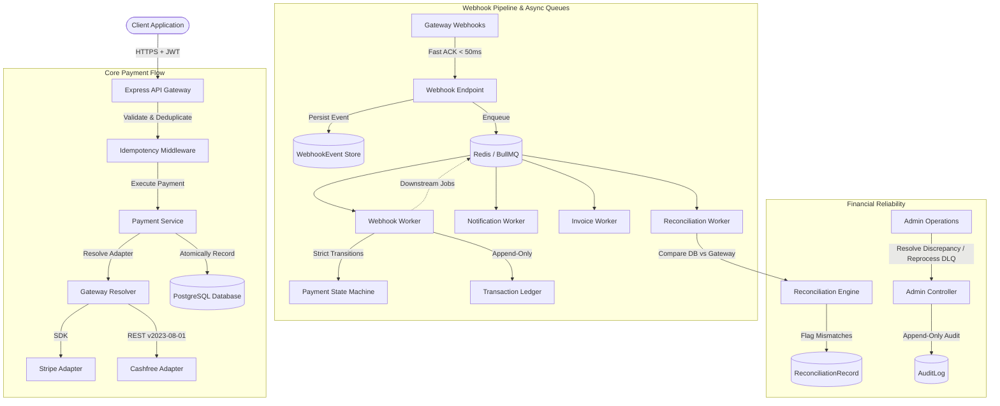

# Production-Grade Multi-Gateway Payment Infrastructure

A resilient, auditable, and high-concurrency payment infrastructure built with **Node.js**, **Express**, **PostgreSQL**, **Prisma**, **Redis**, and **BullMQ**. Supports **Stripe** and **Cashfree** with server-side INR currency integrity, double-entry style immutable transaction ledgering, automated reconciliation, and webhook dead-letter recovery.

---

## Architecture Overview



---

## Key Capabilities

### 1. Multi-Gateway Payment Core
- **Gateway Abstraction**: Uniform `PaymentGateway` interface decoupling business logic from gateway SDKs.
- **Supported Gateways**:
  - **Stripe**: `PaymentIntent` API, 3D-Secure confirmation, webhook verification.
  - **Cashfree**: Orders API (v2023-08-01), HMAC-SHA256 signature verification.
- **Strict Server-Side Currency Validation**: Enforces INR-only with integer/decimal minor-unit arithmetic (paise precision, max 2 decimals).
- **Distributed Failure Compensation**: Automatically cancels upstream gateway payments if local database transactions fail.

### 2. Request-Level Idempotency & Concurrency Protection
- **Header-Based**: Requires `Idempotency-Key` header on all mutation endpoints.
- **Fingerprinting**: SHA-256 canonical hashing of request body, path, and user ID.
- **High-Concurrency Lock**: Backed by PostgreSQL `@@unique([userId, key])`. Tested under 100 simultaneous requests to ensure exactly 1 payment is created.

### 3. Redis + BullMQ Asynchronous Processing
- **Decoupled Architecture**: Critical background tasks run asynchronously across dedicated worker processes:
  - `webhook-queue` (`webhook.worker.js`)
  - `notification-queue` (`notification.worker.js`)
  - `invoice-queue` (`invoice.worker.js`)
  - `reconciliation-queue` (`reconciliation.worker.js`)
  - `payment-queue` (`payment.queue.js`)
- **Deterministic Job Deduplication**: Prevents duplicate execution across network retries.
- **Graceful Degradation**: DB-first durability ensures events are saved in PostgreSQL even if Redis is temporarily unreachable.

### 4. Webhook Reliability & Dead Letter Queue (DLQ)
- **Fast HTTP ACK**: Verifies signature, persists event with status `RECEIVED`, queues the job, and responds with HTTP 200 in $< 50\text{ms}$.
- **Exponential Backoff**: Retries transient processing failures with increasing delay ($5\text{s}, 30\text{s}, 2\text{m}, 10\text{m}, 30\text{m}$).
- **Dead Letter Queue**: Automatically quarantines events that exceed maximum retry attempts (`status: DEAD_LETTER`).
- **Manual Reprocessing**: Admin endpoint `POST /api/v1/admin/webhooks/:eventId/reprocess` allows manual replay with audit tracking.

### 5. Explicit Payment State Machine
- **Strict Transition Rules**:
  - `PENDING` $\to$ `SUCCESS` | `FAILED`
  - `SUCCESS` $\to$ `PARTIALLY_REFUNDED` | `REFUNDED`
  - `PARTIALLY_REFUNDED` $\to$ `PARTIALLY_REFUNDED` | `REFUNDED`
  - Rejects illegal transitions (e.g. `FAILED` $\to$ `REFUNDED`, `REFUNDED` $\to$ `SUCCESS`).

### 6. Immutable Transaction Ledger
- **Double-Entry Principles**: Append-only journal recording `CREDIT` (payments received) and `DEBIT` (refunds processed).
- **Immutability Enforcement**: Repository provides no `update` or `delete` methods. Corrections occur strictly via `ADJUSTMENT` entries.
- **Cumulative Refund Balance**: Accurately tracks remaining refundable amount on partial refunds.

### 7. Payment Reconciliation Engine
- **Automated Discrepancy Detection**: Periodically compares internal database states against gateway APIs.
- **Mismatch Types**: `STATUS_MISMATCH`, `AMOUNT_MISMATCH`, `CURRENCY_MISMATCH`, `MISSING_GATEWAY_PAYMENT`.
- **Audited Resolution**: Administrators can resolve discrepancies through `POST /api/v1/admin/reconciliation/:id/resolve` with mandatory justification.

### 8. Immutable Audit Trail
- Records administrative and financial operations (`PAYMENT_STATE_TRANSITION`, `REFUND_CREATED`, `WEBHOOK_REPROCESSED`, `RECONCILIATION_RESOLVED`).
- Automatically sanitizes sensitive keys (`password`, `token`, `secretKey`, `webhookSecret`).

### 9. Operational Health & Graceful Shutdown
- **Liveness Probe**: `GET /api/health/live`
- **Readiness Probe**: `GET /api/health/ready` (verifies PostgreSQL and Redis connectivity).
- **Graceful Shutdown**: Intercepts `SIGTERM`/`SIGINT`, stops accepting HTTP requests, allows active BullMQ jobs to finish, terminates workers, closes Redis, and disconnects Prisma.

---

## Getting Started

### Prerequisites
- Node.js (v18+)
- PostgreSQL (v14+)
- Redis (v5.0+ for BullMQ)

### Installation
```bash
git clone https://github.com/your-org/payment-integration.git
cd payment-integration
npm install
```

### Environment Configuration
```bash
cp .env.example .env
```

### Database Migration
```bash
npx prisma migrate dev
npx prisma generate
```

### Running the Application
```bash
# Development server (API + Workers)
npm run dev

# Production server
npm start
```

---

## Testing

The automated test suite runs via the native Node.js test runner (`node --test`) using in-memory mock isolation:

```bash
npm test
```

> **Note on External Provider Testing:** Stripe and Cashfree integrations are implemented through provider adapters and covered by automated tests. End-to-end provider testing requires external sandbox credentials and is intentionally not included.

### Test Coverage (84 tests across 15 suites):
* **Authentication**: Registration, login, password hashing, timing attack protection.
* **Authorization & IDOR**: Role enforcement (`ADMIN` vs `USER`), resource ownership verification across payments, orders, refunds, and invoices.
* **Refund Lifecycle**: Full refunds, partial refunds, cumulative balance tracking, over-refund prevention, state transitions, ledger debits.
* **Stripe Adapter**: PaymentIntent creation, status mapping, signature verification.
* **Cashfree Adapter**: Order creation, status mapping, HMAC webhook verification.
* **Gateway-Independent Webhook**: Signature verification, fast ACK, duplicate protection, queue dispatch.
* **Idempotency**: Cached replays, payload mismatch detection, concurrent collision lock.
* **State Machine**: Valid transitions, prohibited state changes.
* **Ledger**: Credits, debits, partial refund balances, append-only immutability.
* **Reconciliation**: Matched checks, status/amount mismatch detection, admin resolution.
* **Webhook Pipeline**: Fast ACK, worker transitions, exponential retry, DLQ quarantine.
* **Queues & Workers**: Job deduplication, async notifications, invoice generation.
* **Concurrency Stress Tests**:
  - 100 simultaneous identical requests $\to$ exactly 1 payment.
  - 100 simultaneous webhook arrivals $\to$ exactly 1 event record.
  - 100 simultaneous ledger creations $\to$ exactly 1 ledger entry.
  - 100 simultaneous refund debits $\to$ exactly 1 debit entry.

---

## Documentation Index

- [Architecture Overview](docs/architecture.md)
- [Asynchronous Processing](docs/async-processing.md)
- [Webhook Reliability & DLQ](docs/webhook-reliability.md)
- [Transaction Ledger](docs/transaction-ledger.md)
- [Reconciliation Engine](docs/reconciliation.md)
- [Audit Logging](docs/audit-logging.md)
- [Queue Architecture](docs/queue-architecture.md)
- [API Specification](docs/api.md)
- [Authentication Guide](docs/authentication.md)
- [Idempotency Guide](docs/idempotency.md)
- [Gateway Architecture](docs/gateway-architecture.md)
