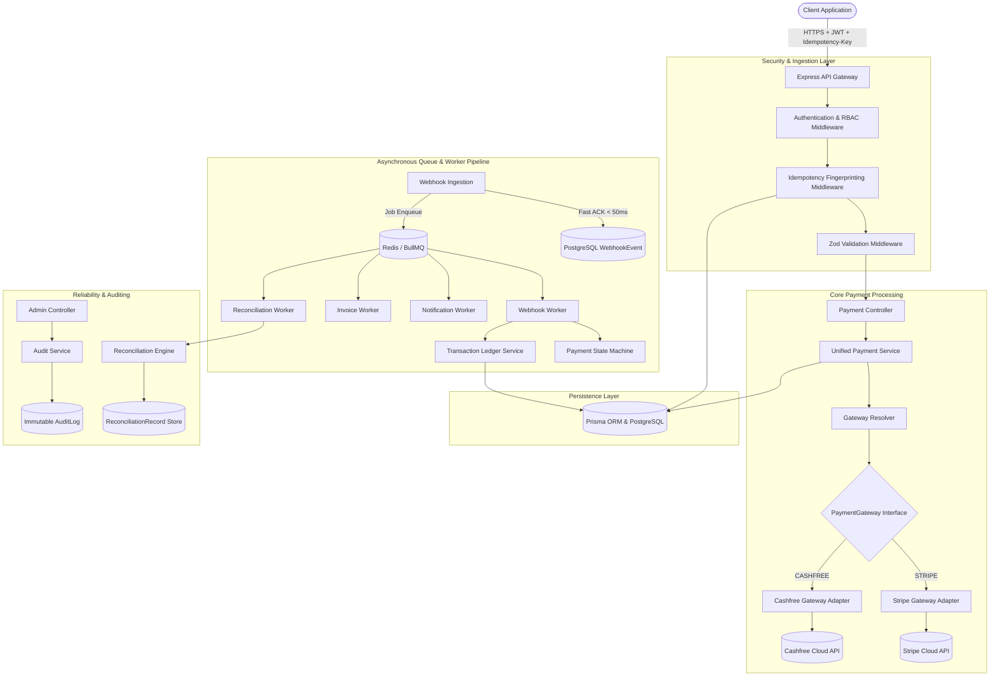

# Multi-Gateway Payment & Financial Infrastructure Architecture

## Overview

The Payment Integration Backend is built on a layered, modular, provider-agnostic financial architecture using **Node.js**, **Express**, **PostgreSQL**, **Prisma ORM**, **Redis**, and **BullMQ**.

Business logic remains strictly decoupled from external payment provider SDKs, while asynchronous queues, state machine guards, immutable ledger journals, and automated reconciliation guarantee operational durability and data integrity.

---

## Architectural Diagram

---

## Architecture Layers

### 1. Ingestion & Security Layer
* **JWT Authentication**: Validates Bearer tokens, establishes caller identity on `req.user`.
* **IDOR Protection & RBAC**: Asserts ownership of resources or requires `ADMIN` privileges before handler invocation.
* **Idempotency Guard**: Hashes canonical request parameters (`userId`, `endpoint`, request body) and locks concurrent identical requests via PostgreSQL unique index.

### 2. Provider Abstraction Layer
* **PaymentGateway Contract**: Abstract class specifying `createPayment`, `getPayment`, `cancelPayment`, `verifyWebhook`, and `mapStatus`.
* **Gateway Resolver**: Dynamic registry returning the appropriate gateway adapter at runtime based on caller parameters or payment record metadata.

### 3. Asynchronous Worker Layer (BullMQ)
* **Job Enqueueing**: Network-bound side effects (customer emails, PDF invoicing, webhook replay) run in dedicated worker processes.
* **Dead Letter Recovery**: Exhausted webhook retries are quarantined for administrative inspection and can be reprocessed manually.

### 4. Financial Consistency Layer
* **Payment State Machine**: Rejects non-linear or illegal payment status transitions.
* **Append-Only Ledger**: Records debit and credit movements, enforcing double-entry traceability and preventing historical tampering.
* **Reconciliation Engine**: Identifies out-of-sync payment states between internal database records and gateway providers.
