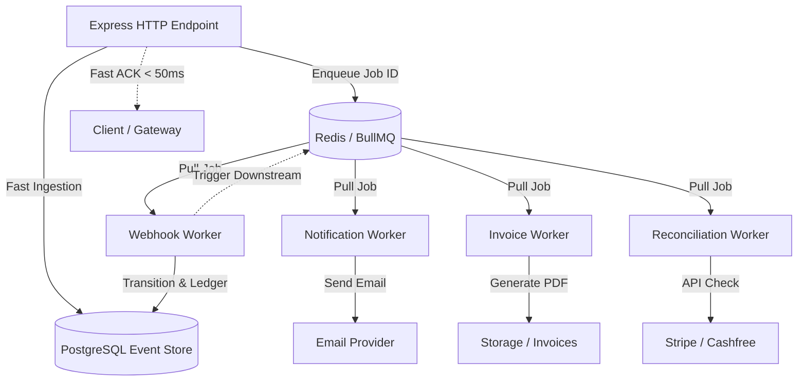

# Asynchronous Processing Architecture

## Overview

The Payment Integration Backend employs **Redis** and **BullMQ** to decouple time-consuming, network-bound, or failure-prone tasks from synchronous HTTP request/response loops.

---

## Queues & Worker Responsibilities

| Queue Name | Worker | Responsibility | Concurrency | Retry Policy |
| :--- | :--- | :--- | :--- | :--- |
| `webhook-queue` | `webhook.worker.js` | Process incoming webhook events, execute state transitions, record ledger entries | 5 | 5 attempts (Exponential backoff) |
| `notification-queue` | `notification.worker.js` | Send transactional emails (payment confirmation, refund notice) | 5 | 5 attempts (Exponential backoff) |
| `invoice-queue` | `invoice.worker.js` | Generate PDF invoices and save metadata | 3 | 3 attempts (Exponential backoff) |
| `reconciliation-queue` | `reconciliation.worker.js` | Run scheduled and manual discrepancy checks between DB and Gateways | 1 | 3 attempts (Exponential backoff) |
| `payment-queue` | `payment.queue.js` | Asynchronous payment verification & settlement checks | 3 | 3 attempts |

---

## Job ID Deduplication

To prevent duplicate job execution during network retries, jobs are assigned deterministic job IDs:

* **Webhook**: `webhook:${gateway}:${eventId}`
* **Notification**: `notif:${type}:${idempotencyKey}`
* **Invoice**: `invoice:order:${orderId}`
* **Reconciliation**: `recon:${gateway}:${timestamp}`

BullMQ discards incoming jobs if an active or pending job with the same ID already exists in the queue.

---

## Graceful Degradation & Redis Failure Handling

* **DB-First Durability**: Webhook events are persisted to PostgreSQL with status `RECEIVED` before the job is pushed to Redis.
* **Degraded Operation**: If Redis becomes temporarily unreachable, incoming payments and verified webhooks remain safe in PostgreSQL.
* **Test Isolation**: In test mode (`NODE_ENV=test`), queues automatically utilize an isolated in-memory stub to avoid socket leaks and cross-test contamination.
