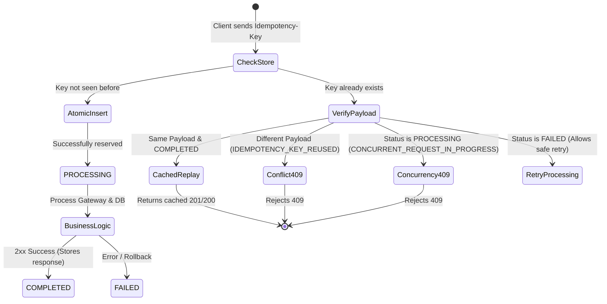

# Request-Level Idempotency & Concurrency Protection

## Overview

In financial payment systems, network retries and double-clicks by users can lead to duplicate payments and double-billing.

Phase 1 implements production-grade **Request-Level Idempotency** powered by PostgreSQL unique constraints and deterministic request body fingerprinting.

---

## Idempotency Lifecycle



---

## Database Schema

```prisma
model IdempotencyKey {
  id             String   @id @default(cuid())
  key            String
  userId         String
  endpoint       String
  requestHash    String
  status         String   // "PROCESSING" | "COMPLETED" | "FAILED"
  responseStatus Int?
  responseBody   Json?
  resourceId     String?
  createdAt      DateTime @default(now())
  expiresAt      DateTime

  user           User     @relation(fields: [userId], references: [id], onDelete: Cascade)

  @@unique([userId, key])
  @@index([expiresAt])
}
```

---

## Concurrency Protection (Race Condition Elimination)

Application-level checks like `if (!exists) { create() }` are vulnerable to race conditions when two or more requests arrive simultaneously.

We solve this using **database-level unique constraints**:
1. When a request arrives, it attempts an atomic `INSERT` into `IdempotencyKey`.
2. If two identical requests arrive at the exact same millisecond:
   - Request 1 successfully inserts the row with status `PROCESSING`.
   - Request 2 hits the PostgreSQL unique constraint `@@unique([userId, key])` (Prisma error `P2002`).
3. The repository catches `P2002`, inspects the existing record, sees status `PROCESSING`, and rejects Request 2 immediately with:
   ```json
   {
     "success": false,
     "errorCode": "CONCURRENT_REQUEST_IN_PROGRESS",
     "message": "A request with this Idempotency-Key is currently being processed. Please try again shortly."
   }
   ```
4. This ensures that **under any level of concurrency (including 100 simultaneous requests), only 1 payment transaction is created.**

---

## Request Fingerprinting

To prevent a client from maliciously or accidentally reusing an old idempotency key with a new payload:
- A SHA-256 hash is computed over the canonically sorted JSON body of the request:
  ```javascript
  const jsonStr = JSON.stringify(body, Object.keys(body).sort());
  const requestHash = crypto.createHash("sha256").update(jsonStr).digest("hex");
  ```
- If a client sends an existing key with a different body (e.g. key `abc` used for `amount: 1000` after previously using `amount: 500`), the system rejects the request with:
  ```json
  {
    "success": false,
    "errorCode": "IDEMPOTENCY_KEY_REUSED",
    "message": "Idempotency key has already been used with different request parameters."
  }
  ```
