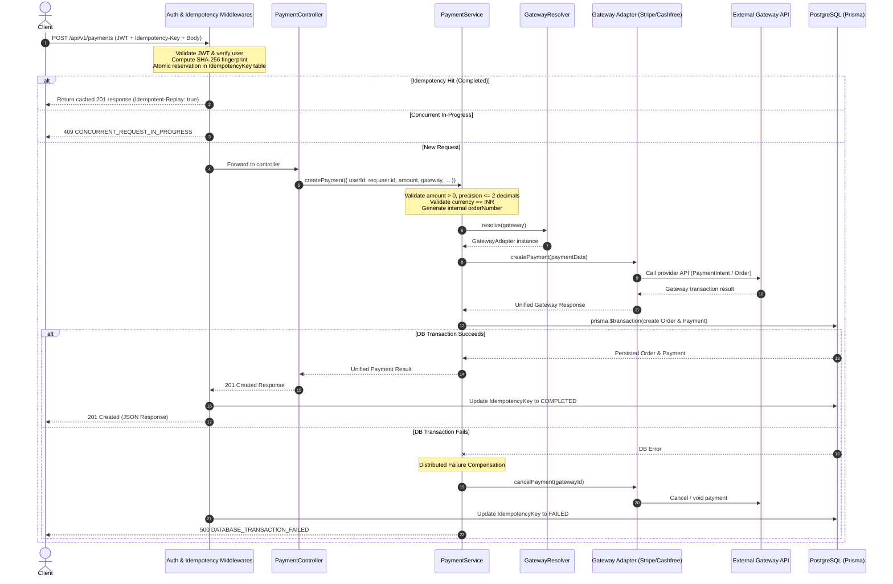

# Unified Payment Flow & Lifecycle (Phase 1)

## Overview

This document details the lifecycle of a payment transaction from client initiation to gateway processing, database persistence, and distributed failure handling.

---

## Payment Creation Sequence Diagram

---

## Server-Side Validation Rules

1. **Amount Precision & Bounds**:
   - Must be a strictly positive number (`amount > 0`).
   - Must not contain more than 2 decimal places (representing rupees and paise).
   - Financial conversions use exact minor currency units (paise) to eliminate IEEE 754 floating-point inaccuracies.
2. **Currency Rules**:
   - Phase 1 strictly enforces `currency === 'INR'`.
3. **Identity Derivation**:
   - The user ID is **never** accepted from the client request body. It is derived strictly from the verified JWT: `req.user.id`.

---

## Distributed Failure Compensation

Because external payment gateways (Stripe/Cashfree) and the PostgreSQL database reside in separate fault domains, two-phase commits are impossible. 

The payment service handles this with **compensating transactions**:
1. When a gateway call succeeds (e.g. creating a PaymentIntent on Stripe or an Order on Cashfree), an external liability is created.
2. If the subsequent database transaction fails to commit the `Order` and `Payment` records, a `catch` block intercepts the failure:
   - Invokes `gatewayAdapter.cancelPayment(gatewayId)` to void or terminate the external transaction.
   - Logs an audit event: `ORPHAN_GATEWAY_PAYMENT_CANCELLED`.
   - Idempotency status is marked `FAILED` to allow client retries.
