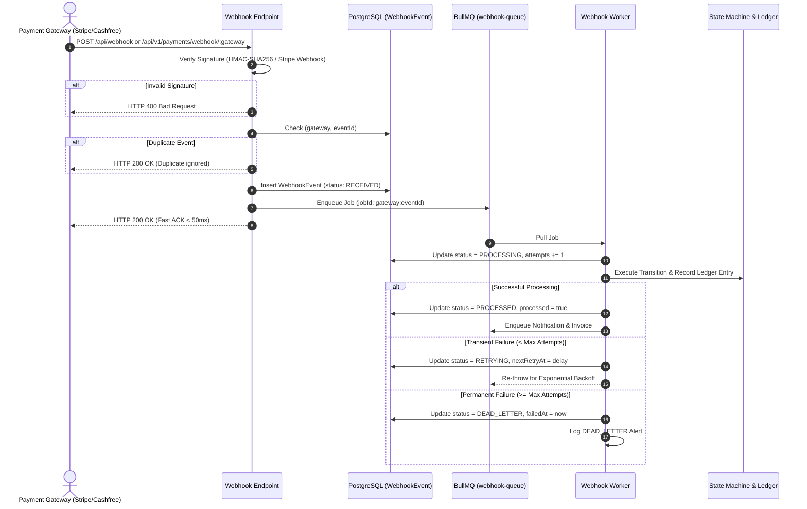

# Webhook Reliability & Dead Letter Queue (DLQ) Pipeline

## Overview

Payment gateways rely on webhooks to notify merchants of asynchronous event resolutions (such as payment completion, dispute alerts, and refund settlement). The Webhook Reliability Pipeline ensures no event is lost, duplicate events are ignored, and transient failures are recovered automatically.



---

## Webhook Event States

```
RECEIVED ──► PROCESSING ──► PROCESSED
                 │
                 ├──► RETRYING ──► (Backoff) ──► PROCESSING
                 │
                 └──► DEAD_LETTER (Max attempts exceeded)
                           │
                           ▼ (Admin Reprocess)
                      PROCESSING ──► PROCESSED
```

| Status | Description |
| :--- | :--- |
| `RECEIVED` | Event cryptographically verified and persisted in PostgreSQL. Awaiting worker processing. |
| `PROCESSING` | Worker actively running business logic and database transactions for this event. |
| `PROCESSED` | Event successfully handled; payment transitioned; ledger entry recorded. |
| `RETRYING` | Transient failure occurred; scheduled for exponential retry attempt. |
| `DEAD_LETTER` | Maximum configured attempts reached without success. Quarantined for operational review. |

---

## Exponential Backoff Policy

When a transient failure occurs (e.g. temporary database lock or downstream network timeout), the retry engine applies exponential backoff:

$$\text{delay} = \min(\text{baseDelay} \times 2^{\text{attempt} - 1},\, 1800000\text{ ms})$$

* **Attempt 1**: Immediate
* **Attempt 2**: 5 to 30 seconds
* **Attempt 3**: 2 minutes
* **Attempt 4**: 10 minutes
* **Attempt 5**: 30 minutes
* **After Attempt 5**: Moves to `DEAD_LETTER` status.

---

## Manual Admin Reprocessing

For events that encounter edge cases or reach the Dead Letter Queue:

```http
POST /api/v1/admin/webhooks/:eventId/reprocess
Authorization: Bearer <ADMIN_JWT>
```

### Reprocessing Protocol
1. Verifies the event exists in PostgreSQL.
2. Creates an immutable `AuditLog` entry referencing the administrator and event ID.
3. Resets event status to `PROCESSING` and re-executes business logic.
4. Returns the updated event state and execution result.
